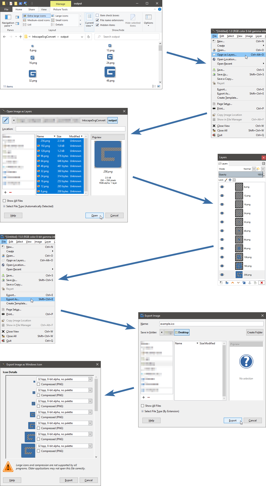

# Inkscape SVG converter
## Purpose
This script helps you to create png graphics of different sizes to use as icons for example.
## Usage
If you have Inkscape installed in "C:\Program Files\Inkscape", you can use the following command.
```
.\InkscapeSvgConvert.ps1 -SourceName .\drawing.svg -DestinationFolder output
```
Otherwise you would have to specify the path to the executable with the following parameter.
```
-InkscapeExe "C:\Program Files\Inkscape\inkscape.exe"
```
# What for?
You could then use Gimp to import all the pictures as layers and export the final picture as icon with multiple resolutions. Example:

