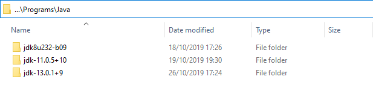

# Java certificate importer
## Who is it for?
Imagine you have a self sigend certificate pki and need to install your root certificate on installed Jdks and because you are developing on several platforms, you need a logic, that detects the old JDK8 folder structure with embedded JRE and also the newer folder structure. Furthermore with new versions the commandline parameters have changed. This logic also takes care of that.
## Example
The following screenshot shows a usable folder structure.



Then the script would be called like this.
```
.\ImportRootCaCert.ps1 -CaCert "path\to\your\certificate.crt.pem" -JavaInstDirectory "path\to\the\shown\Javafoder" -CertName "A memorizable alias" 
```
After the script is done, the Java environments will have the root certificate installed.